Preface xi
An Experiment . . . . . . . . . . . . . . . . . . . . . . . . . . . . . . . . . . . . . . . . . . . . . . . . xi
Versions ofThis Book . . . . . . . . . . . . . . . . . . . . . . . . . . . . . . . . . . . . . . . . . . . . xii
Acknowledgments . . . . . . . . . . . . . . . . . . . . . . . . . . . . . . . . . . . . . . . . . . . . . .xiii
About This Book xv
What You Should Know Before Reading This Book . . . . . . . . . . . . . . . . . . . . . . . . . . xv
Overall Structure ofthe Book . . . . . . . . . . . . . . . . . . . . . . . . . . . . . . . . . . . . . . . xv
How to Read This Book . . . . . . . . . . . . . . . . . . . . . . . . . . . . . . . . . . . . . . . . . . . xvi
The Way I Implement . . . . . . . . . . . . . . . . . . . . . . . . . . . . . . . . . . . . . . . . . . . . xvi
The C++ Standards . . . . . . . . . . . . . . . . . . . . . . . . . . . . . . . . . . . . . . . . . . . . . . xvii
Example Code and Additional Information . . . . . . . . . . . . . . . . . . . . . . . . . . . . . . . xviii
Feedback . . . . . . . . . . . . . . . . . . . . . . . . . . . . . . . . . . . . . . . . . . . . . . . . . . . . xviii
Part I: Basic Features ofMove Semantics 1
1 The Power ofMove Semantics 3
1.1 Motivation for Move Semantics . . . . . . . . . . . . . . . . . . . . . . . . . . . . . . . . . . . . 3
1.1.1 Example with C++03 (Before Move Semantics) . . . . . . . . . . . . . . . . . . . . . 3
1.1.2 Example Since C++11 (Using Move Semantics) . . . . . . . . . . . . . . . . . . . . .11
1.2Implementing Move Semantics. . . . . . . . . . . . . . . . . . . . . . . . . . . . . . . . . . . . 18
1.2.1Using the Copy Constructor . . . . . . . . . . . . . . . . . . . . . . . . . . . . . . . . . 19
1.2.2Using the Move Constructor . . . . . . . . . . . . . . . . . . . . . . . . . . . . . . . . . 20
1.3 Copying as a Fallback . . . . . . . . . . . . . . . . . . . . . . . . . . . . . . . . . . . . . . . . . .21
1.4Move Semantics for const Objects . . . . . . . . . . . . . . . . . . . . . . . . . . . . . . . . . . 22
1.4.1const Return Values . . . . . . . . . . . . . . . . . . . . . . . . . . . . . . . . . . . . . 23
1.5 Summary . . . . . . . . . . . . . . . . . . . . . . . . . . . . . . . . . . . . . . . . . . . . . . . . . . 23
2 Core Features ofMove Semantics 25
2.1 Rvalue References . . . . . . . . . . . . . . . . . . . . . . . . . . . . . . . . . . . . . . . . . . . . 25
2.1.1 Rvalue References in Detail . . . . . . . . . . . . . . . . . . . . . . . . . . . . . . . . . 25
2.1.2 Rvalue References as Parameters . . . . . . . . . . . . . . . . . . . . . . . . . . . . . . 26
2.2 std: :move() . . . . . . . . . . . . . . . . . . . . . . . . . . . . . . . . . . . . . . . . . . . . . . . 27
2.2.1 Header File for std: :move() . . . . . . . . . . . . . . . . . . . . . . . . . . . . . . . . 27
2.2.2 Implementation ofstd: : move() . . . . . . . . . . . . . . . . . . . . . . . . . . . . . . 28
2.3 Moved-From Objects . . . . . . . . . . . . . . . . . . . . . . . . . . . . . . . . . . . . . . . . . . 28
2.3.1 Valid but Unspecif i ed State . . . . . . . . . . . . . . . . . . . . . . . . . . . . . . . . . . 28
2.3.2 Reusing Moved-From Objects . . . . . . . . . . . . . . . . . . . . . . . . . . . . . . . . 29
2.3.3 Move Assignments ofObjects to Themselves . . . . . . . . . . . . . . . . . . . . . . . 30
2.4 Overloading by Different References . . . . . . . . . . . . . . . . . . . . . . . . . . . . . . . . . 30
2.4.1 const Rvalue References . . . . . . . . . . . . . . . . . . . . . . . . . . . . . . . . . . 31
2.5 Passing by Value . . . . . . . . . . . . . . . . . . . . . . . . . . . . . . . . . . . . . . . . . . . . . 31
2.6 Summary . . . . . . . . . . . . . . . . . . . . . . . . . . . . . . . . . . . . . . . . . . . . . . . . . . 32
3 Move Semantics in Classes 35
3.1 Move Semantics in Ordinary Classes . . . . . . . . . . . . . . . . . . . . . . . . . . . . . . . . . 35
3.1.1 When is Move Semantics Automatically Enabled in Classes? . . . . . . . . . . . . . 38
3.1.2 When Generated Move Operations Are Broken . . . . . . . . . . . . . . . . . . . . . 39
3.2 Implementing Special Copy/Move Member Functions . . . . . . . . . . . . . . . . . . . . . . 40
3.2.1 Copy Constructor . . . . . . . . . . . . . . . . . . . . . . . . . . . . . . . . . . . . . . . 41
3.2.2 Move Constructor . . . . . . . . . . . . . . . . . . . . . . . . . . . . . . . . . . . . . . . 42
3.2.3 Copy Assignment Operator . . . . . . . . . . . . . . . . . . . . . . . . . . . . . . . . . . 43
3.2.4 Move Assignment Operator . . . . . . . . . . . . . . . . . . . . . . . . . . . . . . . . . 44
3.2.5 Using the Special Copy/Move Member Functions . . . . . . . . . . . . . . . . . . . . 46
3.3 Rules for Special Member Functions . . . . . . . . . . . . . . . . . . . . . . . . . . . . . . . . . 48
3.3.1 Special Member Functions . . . . . . . . . . . . . . . . . . . . . . . . . . . . . . . . . . 49
3.3.2 By Default, We Have Copying and Moving . . . . . . . . . . . . . . . . . . . . . . . . 50
3.3.3 Declared Copying Disables Moving (Fallback Enabled) . . . . . . . . . . . . . . . . 50
3.3.4 Declared Moving Disables Copying . . . . . . . . . . . . . . . . . . . . . . . . . . . . 51
3.3.5 Deleting Moving Makes No Sense . . . . . . . . . . . . . . . . . . . . . . . . . . . . . 52
3.3.6 Disabling Move Semantics with Enabled Copy Semantics . . . . . . . . . . . . . . . 53
Contents v
3.3.7Moving for Members with Disabled Move Semantics . . . . . . . . . . . . . . . . . .54
3.3.8Exact Rules for Generated Special Member Functions . . . . . . . . . . . . . . . . .54
3.4The Rule ofFive or Three . . . . . . . . . . . . . . . . . . . . . . . . . . . . . . . . . . . . . . . .57
3.5Summary . . . . . . . . . . . . . . . . . . . . . . . . . . . . . . . . . . . . . . . . . . . . . . . . . . 58
4 How to Benef i t From Move Semantics 59
4.1Avoid Objects with Names . . . . . . . . . . . . . . . . . . . . . . . . . . . . . . . . . . . . . . .59
4.1.1When You Cannot Avoid Using Names . . . . . . . . . . . . . . . . . . . . . . . . . .60
4.2Avoid Unnecessary std: :move(). . . . . . . . . . . . . . . . . . . . . . . . . . . . . . . . . . 60
4.3Initialize Members with Move Semantics . . . . . . . . . . . . . . . . . . . . . . . . . . . . . .61
4.3.1Initialize Members the Classical Way. . . . . . . . . . . . . . . . . . . . . . . . . . . 61
4.3.2 Initialize Members via Moved Parameters Passed by Value . . . . . . . . . . . . . .63
4.3.3Initialize Members via Rvalue References . . . . . . . . . . . . . . . . . . . . . . . . . 66
4.3.4 Compare the Different Approaches . . . . . . . . . . . . . . . . . . . . . . . . . . . . . 70
4.3.5Summary for Member Initialization . . . . . . . . . . . . . . . . . . . . . . . . . . . .72
4.3.6 Should We Now Always Pass by Value and Move? . . . . . . . . . . . . . . . . . . . 73
4.4 Move Semantics in Class Hierarchies . . . . . . . . . . . . . . . . . . . . . . . . . . . . . . . . . 75
4.4.1Implementing a Polymorphic Base Class . . . . . . . . . . . . . . . . . . . . . . . . . 75
4.4.2 Implementing a Polymorphic Derived Class. . . . . . . . . . . . . . . . . . . . . . . 77
4.5 Summary . . . . . . . . . . . . . . . . . . . . . . . . . . . . . . . . . . . . . . . . . . . . . . . . . .78
5Overloading on Reference Qualif i ers 79
5.1Return Type ofGetters . . . . . . . . . . . . . . . . . . . . . . . . . . . . . . . . . . . . . . . . . . 79
5.1.1Return by Value . . . . . . . . . . . . . . . . . . . . . . . . . . . . . . . . . . . . . . . . 79
5.1.2Return by Reference . . . . . . . . . . . . . . . . . . . . . . . . . . . . . . . . . . . . . .80
5.1.3Using Move Semantics to Solve the Dilemma . . . . . . . . . . . . . . . . . . . . . . 81
5.2Overloading on Qualif i ers . . . . . . . . . . . . . . . . . . . . . . . . . . . . . . . . . . . . . . . . 83
5.3When to Use Reference Qualif i ers . . . . . . . . . . . . . . . . . . . . . . . . . . . . . . . . . . .84
5.3.1Reference Qualif i ers for Assignment Operators . . . . . . . . . . . . . . . . . . . . . 84
5.3.2Reference Qualif i ers for Other Member Functions . . . . . . . . . . . . . . . . . . . . 86
5.4Summary . . . . . . . . . . . . . . . . . . . . . . . . . . . . . . . . . . . . . . . . . . . . . . . . . . 87
6Moved-From States 89
6.1Required and Guaranteed States ofMoved-From Objects . . . . . . . . . . . . . . . . . . . . .89
6.1.1 Required States of Moved-From Objects. . . . . . . . . . . . . . . . . . . . . . . . . 90
vi Contents
6.1.2 Guaranteed States of Moved-From Objects . . . . . . . . . . . . . . . . . . . . . . . . 91
6.1.3 Broken Invariants. . . . . . . . . . . . . . . . . . . . . . . . . . . . . . . . . . . . . . . 92
6.2 Destructible and Assignable . . . . . . . . . . . . . . . . . . . . . . . . . . . . . . . . . . . . . .93
6.2.1Assignable and Destructible Moved-From Objects. . . . . . . . . . . . . . . . . . . 93
6.2.2 Non-Destructible Moved-From Objects . . . . . . . . . . . . . . . . . . . . . . . . . . 94
6.3Dealing with Broken Invariants . . . . . . . . . . . . . . . . . . . . . . . . . . . . . . . . . . . . 97
6.3.1Breaking Invariants Due to a Moved Value Member . . . . . . . . . . . . . . . . . . .97
6.3.2Breaking Invariants Due to Moved Consistent Value Members . . . . . . . . . . . . 100
6.3.3Breaking Invariants Due to Moved Pointer-Like Members . . . . . . . . . . . . . . . 102
6.4 Summary . . . . . . . . . . . . . . . . . . . . . . . . . . . . . . . . . . . . . . . . . . . . . . . . . . 106
7 Move Semantics and noexcept 107
7.1 Move Constructors with and without noexcept . . . . . . . . . . . . . . . . . . . . . . . . . . 107
7.1.1 Move Constructors without noexcept . . . . . . . . . . . . . . . . . . . . . . . . . . .107
7.1.2 Move Constructors with noexcept . . . . . . . . . . . . . . . . . . . . . . . . . . . . . 110
7.1.3 Is noexcept Worth It? . . . . . . . . . . . . . . . . . . . . . . . . . . . . . . . . . . . . 115
7.2 Details ofnoexcept Declarations . . . . . . . . . . . . . . . . . . . . . . . . . . . . . . . . . . . 116
7.2.1 Rules for Declaring Functions with noexcept . . . . . . . . . . . . . . . . . . . . . .116
7.2.2 noexcept for Special Member Functions . . . . . . . . . . . . . . . . . . . . . . . . . 117
7.3noexcept Declarations in Class Hierarchies . . . . . . . . . . . . . . . . . . . . . . . . . . . . 120
7.3.1 Checking for noexcept Move Constructors in Abstract Base Classes . . . . . . . .120
7.4 When and Where to Use noexcept . . . . . . . . . . . . . . . . . . . . . . . . . . . . . . . . . .122
7.5 Summary . . . . . . . . . . . . . . . . . . . . . . . . . . . . . . . . . . . . . . . . . . . . . . . . . . 123
8 Value Categories125
8.1 Value Categories . . . . . . . . . . . . . . . . . . . . . . . . . . . . . . . . . . . . . . . . . . . . . 125
8.1.1 History ofValue Categories . . . . . . . . . . . . . . . . . . . . . . . . . . . . . . . . .125
8.1.2 Value Categories Since C++11 . . . . . . . . . . . . . . . . . . . . . . . . . . . . . . . 127
8.1.3 Value Categories Since C++17 . . . . . . . . . . . . . . . . . . . . . . . . . . . . . . . 128
8.2 Special Rules for Value Categories . . . . . . . . . . . . . . . . . . . . . . . . . . . . . . . . . .130
8.2.1 Value Category ofFunctions . . . . . . . . . . . . . . . . . . . . . . . . . . . . . . . . .130
8.2.2 Value Category ofData Members . . . . . . . . . . . . . . . . . . . . . . . . . . . . . . 130
8.3 Impact ofValue Categories When Binding References . . . . . . . . . . . . . . . . . . . . . .133
8.3.1 Overload Resolution with Rvalue References . . . . . . . . . . . . . . . . . . . . . . . 133
8.3.2 Overloading by Reference and Value . . . . . . . . . . . . . . . . . . . . . . . . . . . . 134
8.4 When Lvalues become Rvalues . . . . . . . . . . . . . . . . . . . . . . . . . . . . . . . . . . . . 135
8.5 When Rvalues become Lvalues . . . . . . . . . . . . . . . . . . . . . . . . . . . . . . . . . . . . 135
8.6 Checking Value Categories with decltype . . . . . . . . . . . . . . . . . . . . . . . . . . . . . 136
8.6.1 Using decltype to Check the Type of Names . . . . . . . . . . . . . . . . . . . . . . 136
8.6.2 Using decltype to Check the Value Category . . . . . . . . . . . . . . . . . . . . . . 137
8.7 Summary . . . . . . . . . . . . . . . . . . . . . . . . . . . . . . . . . . . . . . . . . . . . . . . . . . 138
Part II: Move Semantics in Generic Code139
9 Perfect Forwarding141
9.1 Motivation for Perfect Forwarding . . . . . . . . . . . . . . . . . . . . . . . . . . . . . . . . . . 141
9.1.1 What we Need to Perfectly Forward Arguments . . . . . . . . . . . . . . . . . . . . . 141
9.2 Implementing Perfect Forwarding . . . . . . . . . . . . . . . . . . . . . . . . . . . . . . . . . . . 143
9.2.1 Universal (or Forwarding) References . . . . . . . . . . . . . . . . . . . . . . . . . . .144
9.2.2 std: :forward<>() . . . . . . . . . . . . . . . . . . . . . . . . . . . . . . . . . . . . .145
9.2.3 The Effect ofPerfect Forwarding . . . . . . . . . . . . . . . . . . . . . . . . . . . . . .146
9.3 Rvalue References versus Universal References . . . . . . . . . . . . . . . . . . . . . . . . . . 147
9.3.1 Rvalue References of Actual Types . . . . . . . . . . . . . . . . . . . . . . . . . . . . . 148
9.3.2 Rvalue References of Function Template Parameters . . . . . . . . . . . . . . . . . . 148
9.4 Overload Resolution with Universal References . . . . . . . . . . . . . . . . . . . . . . . . . .149
9.4.1 Fixing Overload Resolution with Universal References . . . . . . . . . . . . . . . . .150
9.5 Perfect Forwarding in Lambdas . . . . . . . . . . . . . . . . . . . . . . . . . . . . . . . . . . . .151
9.6 Summary . . . . . . . . . . . . . . . . . . . . . . . . . . . . . . . . . . . . . . . . . . . . . . . . . . 152
10 Tricky Details ofPerfect Forwarding 153
10.1Universal References as Non-Forwarding References . . . . . . . . . . . . . . . . . . . . . . . 153
10.1.1 Universal References and const . . . . . . . . . . . . . . . . . . . . . . . . . . . . . .153
10.1.2 Universal References in Detail . . . . . . . . . . . . . . . . . . . . . . . . . . . . . . . .156
10.1.3 Universal References of Specif i c Types . . . . . . . . . . . . . . . . . . . . . . . . . . 157
10.2 Universal or Ordinary Rvalue Reference? . . . . . . . . . . . . . . . . . . . . . . . . . . . . . . 159
10.2.1 Rvalue References of Members ofGeneric Types . . . . . . . . . . . . . . . . . . . .159
10.2.2 Rvalue References of Parameters in Class Templates . . . . . . . . . . . . . . . . . . 160
10.2.3Rvalue References of Parameters in Full Specializations . . . . . . . . . . . . . . . .161
10.3How the Standard Specif i es Perfect Forwarding . . . . . . . . . . . . . . . . . . . . . . . . . . 163
10.3.1 Explicit Specif i cation ofTypes for Universal References . . . . . . . . . . . . . . . .165
10.3.2 Conf l icting Template Parameter Deduction with Universal References . . . . . . . 166
10.3.3Pure RValue References of Generic Types . . . . . . . . . . . . . . . . . . . . . . . . . 167
10.4 Nasty Details ofPerfect Forwarding. . . . . . . . . . . . . . . . . . . . . . . . . . . . . . . . .167
10.4.1“Universal” versus “Forwarding” Reference . . . . . . . . . . . . . . . . . . . . . . . 168
10.4.2Why && for Both Ordinary Rvalues and Universal References? . . . . . . . . . . . . 169
10.5Summary . . . . . . . . . . . . . . . . . . . . . . . . . . . . . . . . . . . . . . . . . . . . . . . . . . 169
11 Perfect Passing with auto&& 171
11.1 Default Perfect Passing . . . . . . . . . . . . . . . . . . . . . . . . . . . . . . . . . . . . . . . . .171
11.1.1Default Perfect Passing in Detail . . . . . . . . . . . . . . . . . . . . . . . . . . . . . . 171
11.2 Universal References with auto&& . . . . . . . . . . . . . . . . . . . . . . . . . . . . . . . . . . 173
11.2.1Type Deduction ofauto&& . . . . . . . . . . . . . . . . . . . . . . . . . . . . . . . . . .174
11.2.2Perfectly Forwarding an auto&& Reference . . . . . . . . . . . . . . . . . . . . . . . . 175
11.3auto&& as Non-Forwarding Reference . . . . . . . . . . . . . . . . . . . . . . . . . . . . . . . . 176
11.3.1Universal References and the Range-Based for Loop . . . . . . . . . . . . . . . . .176
11.4 Perfect Forwarding in Lambdas . . . . . . . . . . . . . . . . . . . . . . . . . . . . . . . . . . . .180
11.5Using auto&& in C++20 Function Declarations . . . . . . . . . . . . . . . . . . . . . . . . . . 181
11.6 Summary . . . . . . . . . . . . . . . . . . . . . . . . . . . . . . . . . . . . . . . . . . . . . . . . . .181
12 Perfect Returning with decltype(auto) 183
12.1 Perfect Returning . . . . . . . . . . . . . . . . . . . . . . . . . . . . . . . . . . . . . . . . . . . . .183
12.2 decltype(auto) . . . . . . . . . . . . . . . . . . . . . . . . . . . . . . . . . . . . . . . . . . . .184
12.2.1Return Type decltype(auto) . . . . . . . . . . . . . . . . . . . . . . . . . . . . . . . 185
12.2.2 Deferred Perfect Returning . . . . . . . . . . . . . . . . . . . . . . . . . . . . . . . . . . 187
12.2.3Perfect Forwarding and Returning with Lambdas . . . . . . . . . . . . . . . . . . . . 189
12.3Summary . . . . . . . . . . . . . . . . . . . . . . . . . . . . . . . . . . . . . . . . . . . . . . . . . .190
Part III: Move Semantics in the C++ Standard Library 191
13 Move-Only Types193
13.1Declaring and Using Move-Only Types . . . . . . . . . . . . . . . . . . . . . . . . . . . . . . .193
13.1.1Declaring Move-Only Types . . . . . . . . . . . . . . . . . . . . . . . . . . . . . . . . . 194
13.1.2Using Move-Only Types . . . . . . . . . . . . . . . . . . . . . . . . . . . . . . . . . . .194
13.1.3Passing Move-Only Objects as Arguments . . . . . . . . . . . . . . . . . . . . . . . .195
13.1.4Returning Move-Only Objects by Value . . . . . . . . . . . . . . . . . . . . . . . . . . 196
13.1.5 Moved-From States ofMove-Only Objects . . . . . . . . . . . . . . . . . . . . . . . . 196
13.2 Summary . . . . . . . . . . . . . . . . . . . . . . . . . . . . . . . . . . . . . . . . . . . . . . . . . . 197
14 Moving Algorithms and Iterators199
14.1Moving Algorithms . . . . . . . . . . . . . . . . . . . . . . . . . . . . . . . . . . . . . . . . . . .199
14.2 Removing Algorithms . . . . . . . . . . . . . . . . . . . . . . . . . . . . . . . . . . . . . . . . . . 201
14.3Move Iterators . . . . . . . . . . . . . . . . . . . . . . . . . . . . . . . . . . . . . . . . . . . . . . .204
14.3.1Move Iterators in Algorithms . . . . . . . . . . . . . . . . . . . . . . . . . . . . . . . .205
14.3.2Move Iterators in Constructors and Member Functions . . . . . . . . . . . . . . . . . 207
14.4 Summary . . . . . . . . . . . . . . . . . . . . . . . . . . . . . . . . . . . . . . . . . . . . . . . . . . 208
15 Move Semantics in Types ofthe C++ Standard Library 209
15.1Move Semantics for Strings . . . . . . . . . . . . . . . . . . . . . . . . . . . . . . . . . . . . . . 209
15.1.1 String Assignments and Capacity . . . . . . . . . . . . . . . . . . . . . . . . . . . . . . 209
15.2 Move Semantics for Containers . . . . . . . . . . . . . . . . . . . . . . . . . . . . . . . . . . . . 212
15.2.1Basic Move Support for Containers as a Whole . . . . . . . . . . . . . . . . . . . . . 212
15.2.2 Insert and Emplace Functions . . . . . . . . . . . . . . . . . . . . . . . . . . . . . . . . 214
15.2.3 Move Semantics for std:: array<> . . . . . . . . . . . . . . . . . . . . . . . . . . . . 216
15.3 Move Semantics for Vocabulary Types . . . . . . . . . . . . . . . . . . . . . . . . . . . . . . . . 216
15.3.1Move Semantics for Pairs . . . . . . . . . . . . . . . . . . . . . . . . . . . . . . . . . . . 217
15.3.2Move Semantics for std:: optional<> . . . . . . . . . . . . . . . . . . . . . . . . .221
15.4 Move Semantics for Smart Pointers . . . . . . . . . . . . . . . . . . . . . . . . . . . . . . . . . . 222
15.4.1 Move Semantics for std:: shared_ptr<> . . . . . . . . . . . . . . . . . . . . . . . . 222
15.4.2Move Semantics for std:: unique_ptr<> . . . . . . . . . . . . . . . . . . . . . . . . 223
15.5 Move Semantics for IOStreams . . . . . . . . . . . . . . . . . . . . . . . . . . . . . . . . . . . . 225
15.5.1Moving IOStream Objects . . . . . . . . . . . . . . . . . . . . . . . . . . . . . . . . . . 225
15.5.2 Using Temporary IOStreams . . . . . . . . . . . . . . . . . . . . . . . . . . . . . . . . .226
15.6 Move Semantics for Multithreading . . . . . . . . . . . . . . . . . . . . . . . . . . . . . . . . . . 227
15.6.1std: :thread<> and std:: jthread<> . . . . . . . . . . . . . . . . . . . . . . . . . .227
15.6.2Futures, Promises, and Packaged Tasks . . . . . . . . . . . . . . . . . . . . . . . . . . 228
15.7Summary . . . . . . . . . . . . . . . . . . . . . . . . . . . . . . . . . . . . . . . . . . . . . . . . . . 230
Glossary                                            231

Preface
Move semantics, introduced with C++11, has become a hallmark ofmodern C++ programming. However, it
also complicates the language in many ways. Even after several years of support, experienced programmers
struggle with all the details of move semantics, style guides still recommend different consequences for
programming even oftrivial classes, and we still discuss semantic details in the C++ standards committee.
Whenever I have taught what I have learned about C++ move semantics so far, I have said, “Somebody
has to write a book about all this,” and the usual answer was: “Yes, please do!” So, I f i nally did.
As always when writing a book about C++, I was surprised about the number ofaspects to be taught, the
situations to be clarif i ed, and the consequences to be described. It really was time to write a book about all
aspects of move semantics, covering all C++ versions from C++11 up to C++20. I learned a lot and I am
sure you will too.

An Experiment
This book is an experiment in two ways:
• I am writing an in-depth book covering a complex core language feature without the direct help ofa core
language expert as a co-author. However, I can ask questions and I do.
• I am publishing the book myself on Leanpub and for printing on demand. That is, this book is written
step by step and I will publish new versions as soon there is a signif i cant improvement that makes the
publication ofa new version worthwhile.
The good thing is:
•You get the view ofthe language features from an experienced application programmer—somebody who
feels the pain a feature might cause and asks the relevant questions to be able to motivate and explain the
design and its consequences for programming in practice.
• You can benef i t from my experience with move semantics while I am still writing.
•This book and all readers can benef it from your early feedback.
This means that you are also part of the experiment. So help me out: give feedback about f l aws, errors,
features that are not explained well, or gaps, so that we all can benef i t from these improvements.

Versions ofThis Book
Because this book is written incrementally, the following is a history ofthe major updates (newest f i rst):
•2020-10-27: Several f i xes (see errata)
• 2020-09-18: Using lambdas with template parameters (since C++20)
• 2020-09-15: Fix a bug with full specializations ofuniversal references
•2020-09-12: std: :move() for data members
• 2020-09-10: Fixing deferred perfect returning
• 2020-09-09: Proofreading done and f i nal f i xes to go into print
• 2020-09-06: Helper trait is_nothrow_movable for abstract base classes
• 2020-09-06: Value category of(references to) functions
• 2020-09-05: Clarif i cations on auto&& including using it in C++20 functions
• 2020-08-29: Move assignments ofobjects to themselves
• 2020-08-28: Move semantics for std: :pair<>, std:: optional<>, threads, etc.
• 2020-08-28: Unique pointers, IOStreams, and other move-only types
•2020-08-26: Several clarif i cations about universal references
• 2020-08-25: Using std: :move() when calling member functions
• 2020-08-20: New chapter about move-only types
• 2020-08-19: Discussion ofnoexcept details
• 2020-08-18: New chapter about moving algorithms and iterators
•2020-08-10: Description ofmove semantics for shared pointers
• 2020-08-10: Motivation for the reuse of moved-from objects and clarification of move assignments of
objects to themselves
• 2020-08-09: Recommendation not to return by value with const
• 2020-07-27: Move semantics for strings and containers
• 2020-07-24: General remarks on using reference qualif i ers
• 2020-07-23: Description of details of type deduction of universal references and reference collapsing for
perfect forwarding
• 2020-07-07: Description of perfect returning for lambdas
• 2020-06-21: New chapter about perfect returning (with small f i xes for perfect forwarding)
• 2020-06-12: Improvements of the chapter about “invalid” states
• 2020-06-08: New chapter about using noexcept
•2020-06-06: Improvements of the chapter about invalid states
• 2020-05-03: Fixing ofmove semantics in class hierarchies
• 2020-04-29: Fixing ofmove semantics for classes and invalid states after review
• 2020-04-25: Fixing ofcode layout and missing f i gures in non-PDF versions
• 2020-04-22: New chapter about moved-from states
• 2020-04-13: Discussion ofwhen you cannot avoid using std:: move()
• 2020-02-01: Discussion ofwhen automatically generated move operations are broken
•2020-01-19: Constructors with universal references
• 2020-01-04: The initial published version ofthe book

About This Book
This book teaches C++ move semantics. Starting from the basic principles, it motivates and explains all
features and corner cases of move semantics so that as a programmer, you can understand and use move
semantics correctly. The book is valuable for those who are just starting to learn about move semantics and
is essential for those who are using it already.
As usual for my books, the focus lies on the application ofthe new features in practice and the book will
demonstrate how features impact day-to-day programming and how you can benef i t from them in projects.
This applies to both application programmers and programmers who provide generic frameworks and foun-
dation libraries.

What You Should Know Before Reading This Book
To get the most from this book, you should already be familiar with C++. You should be familiar with
the concepts of classes and references in general, and you should be able to write C++ programs using
components such as IOStreams and containers from the C++ standard library. You should also be familiar
with the basic features of“Modern C++,” such as auto or the range-based for loop.
However, you do not have to be an expert. My goal is to make the content understandable for the average
C++ programmer who does not necessarily know all the details of the latest features. I will discuss basic
features and review more subtle issues as the need arises.
This ensures that the text is accessible to experts and intermediate programmers alike.

Overall Structure ofthe Book
This book covers all aspects of C++ move semantics up to C++20. This applies to both language and
library features as well as both features that affect day-to-day application programming and features for
the sophisticated implementation of (foundation) libraries. However, the more general cases and examples
usually come f i rst.
The different chapters are grouped, so that didactically you should read the book from beginning to end.
That is, later chapters usually rely on features introduced in earlier chapters. However, cross-references also
help in specif i c subsequent topics, indicating where they refer to features and aspects introduced earlier.

The book therefore contains the following parts:
• Part I covers the basic features ofmove semantics (especially for non-generic code).
• Part II covers the features of move semantics for generic code (especially used in templates and generic
lambdas).
• Part III covers the use of move semantics in the C++ standard library (giving also a good example of
how to use move semantics in practice).

How to Read This Book
Do not be afraid by the number of pages in this book. As always with C++, things can become pretty
complicated when you look into details (such as implementing templates). For a basic understanding, the
first third ofthe book (Part I, especially chapters 1 to 5) is sufficient.
In my experience, the best way to learn something new is to look at examples. Therefore, you will find
a lot of examples throughout the book. Some are just a few lines of code illustrating an abstract concept,
whereas others are complete programs that provide a concrete application ofthe material. The latter kind of
examples will be introduced by a C++ comment describing the f i le containing the program code. You can
find these files on the website for this book at http://www.cppmove.com.


## Part I
Basic Features ofMove Semantics
This part of the book introduces the basic features of move semantics that are not specif i c to generic pro-
gramming (i.e., templates). They are particularly helpful for application programmers in their day-to-day
programming and therefore every C++ programmer using Modern C++ should know them.
Move semantics features for generic programming are covered in Part II.

### Chapter 1
The Power of Move Semantics
This chapter demonstrates the basic principles and benef i ts ofmove semantics using a short code example.
1.1 Motivation for Move Semantics
To understand the basic principles of move semantics, let us look at the execution of a small piece of code,
f i rst without move semantics (i.e., compiled with an old C++ compiler that supports only C++03) and then
with move semantics (compiled with a modern C++ compiler that supports C++11 or later).

1.1.1 Example with C++03 (Before Move Semantics)
Assume we have the following program:
basics/motiv03.cpp

```cpp
#include <string>
#include <vector>
std::vector<std::string> createAndInsert()
{
    std::vector<std::string> coll; //create vectorr ofstrings
    coll.reserve(3); //reserve memory for 3 elements
    std::string s = "data";//create string object
    coll.push_back(s);//insert string object
    coll.push_back(s+s); //insert temporary string
    coll.push_back(s); //insert string
    return coll; //return vector ofstrings
}

int main()
{
    std::vector<std::string> v; //create empty vector ofstrings
    ...
    v = createAndInsert(); //assign returned vector ofstrings
    ...
}

```

Let us look at the individual steps ofthe program (inspecting both the stack and the heap) when we compile this program with a C++ compiler that does not support move semantics.

• First, in main(), we create the empty vector v:
```cpp
std::vector<std::string> v;
```
which is placed on the stack as an object that has 0 as the number of elements and no memory allocated for elements.

• Then, we call

```cpp
v = createAndInsert();
```
where we create another empty vector coll on the stack and reserve memory for three elements on the heap:

```cpp
std::vector<std::string> coll;
coll.reserve(3);
```

The allocated memory is not initialized because the number ofelements is still 0.
• Then, we create a string initialized with "data":  
```cpp
std::string s = "data";
```

A string is something like a vector with char elements. Essentially, we create an object on the stack with a member for the number of characters (having the value 4) and a pointer to the memory for the characters.[1]
After this statement, the program has the following state: we have three objects on the stack: `v`, `coll`, and `s`. Two ofthem, coll and s, have allocated memory on the heap:[2]

> [1] Internally, strings also store a terminating null character to avoid allocating memory when they are asked for a C string representation of their value with the member function `c_str()`.

> [2] With the small string optimization (SSO), the string s might store its whole value on the stack provided the value is not too long. However, for the general case, let us assume that we do not have the small string optimization or the value of the string is long enough so that the small string optimization does not happen.

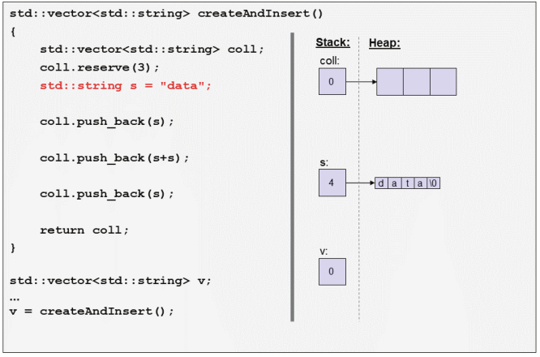

The next step is the command to insert the string into the vector coll:
```cpp
coll.push_back(s);
```

All containers in the C++ standard library have value semantics, which means that they create copies of the values passed to them. As a result, we get a first element in the vector, which is a full (deep) copy of
the passed value/object s:

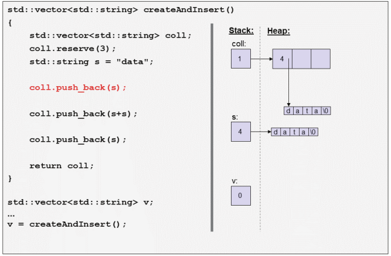


So far, we have nothing to optimize in this program. The current state is that we have two vectors, v and
coll, and two strings, s and its copy, which is the f i rst element in coll. They should all be separate
objects with their own memory for the value, because modifying one of them should not impact any of
the other objects.
• Let us now look at the next statement, which creates a new temporary string and again inserts it into the vector:
```cpp
coll.push_back(s+s);
```

This statement is performed in three steps:
1. We create the temporary string `s+s`:

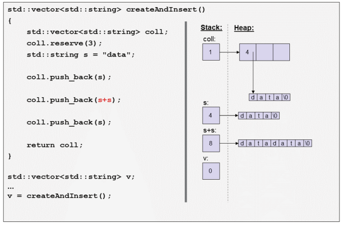

2. We insert this temporary string into the vector coll. As always, the container creates a copy of the
passed value, which means that we create a deep copy of the temporary string, including allocating
memory for the value:

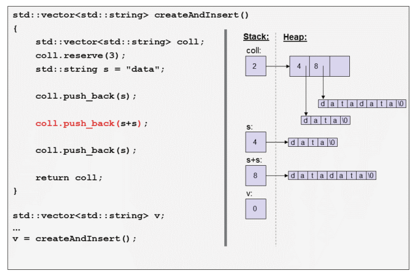

3. At the end ofthe statement, the temporary string s+s is destroyed because we no longer need it:

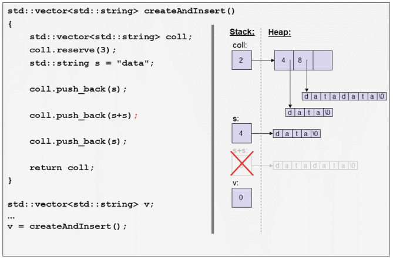

Here, we have the f i rst moment where we generate code that is not performing well: we create a copy
of a temporary string and destroy the source of the copy immediately afterwards, which means that we
unnecessarily allocate and free memory that we could have just moved from the source to the copy.
• With the next statement, again we insert s into coll:

```cpp
coll.push_back(s);
```

Again, coll copies s:

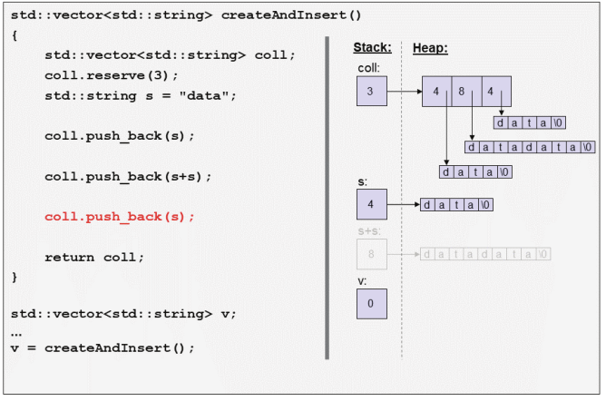

This is also something to improve: because the value of s is no longer needed some optimization could
use the memory of s as memory for the new element in the vector instead.
• At the end of `createAndInsert()` we come to the return statement:

```cpp
return coll;
}
```

Here, the behavior of the program becomes a bit more complicated. We return by value (the return type is not a reference), which should be a copy of the value in the return statement, coll. Creating a copy
of coll means that we have to create a deep copy of the whole vector with all of its elements. Thus, we
have to allocate heap memory for the array ofelements in the vector and heap memory for the value each
string allocates to hold its value. Here, we would have to allocate memory 4 times.
However, since at the same time coll is destroyed because we leave the scope where it is declared,
the compiler is allowed to perform the named return value optimization (NRVO). This means that the
compiler can generate code so that coll is just used as the return value.
This optimization is allowed even if this would change the functional behavior of the program. If we
had a print statement in the copy constructor of a vector or string, we would see that the program no
longer has the output from the print statement. This means that this optimization changes the functional
behavior of the program. However, that is OK, because we explicitly allow this optimization in the C++
standard even if it has side effects. Nobody should expect that a copy is done here, in the same way that
nobody should expect that it is not, either. It is simply up to the compiler whether the named return value
optimization is performed.
Let us assume that we have the named `return value optimization`. In that case, at the end of the return
statement, coll now becomes the return value and the destructor of s is called, which frees the memory
allocated when it was declared:

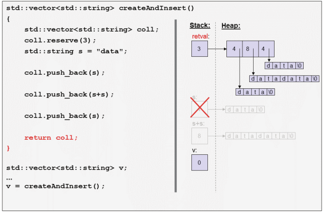

Finally, we come to the assignment ofthe return value to v:

```cpp
v = createAndInsert();
```

Here, we really get behavior that can be improved: the usual assignment operator has the goal ofgiving v
the same value as the source value that is assigned. In general, any assigned value should not be modif i ed
and should be independent from the object that the value was assigned to. So, the assignment operator
will create a deep copy ofthe whole return value:

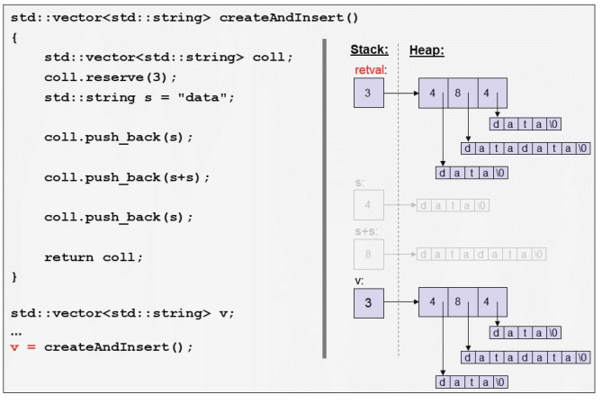

However, right after that, we no longer need the temporary return value and we destroy it:

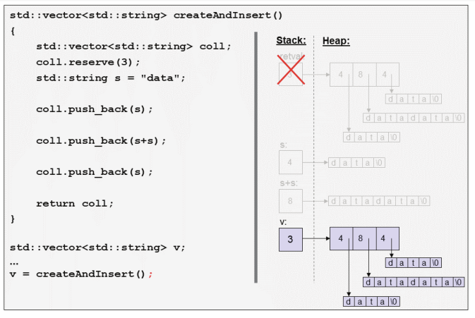

Again, we create a copy of a temporary object and destroy the source of the copy immediately after-
wards, which means that we again unnecessarily allocate and free memory. This time it applies to four
allocations, one for the vector and one for each string element.
For the state ofthis program after the assignment in main(), we allocated memory ten times and released it
six times. The unnecessary memory allocations were caused by:
• Inserting a temporary object into the collection
• Inserting an object into the collection where we no longer need the value
• Assigning a temporary vector with all its elements
We can more or less avoid these performance penalties. In particular, instead of the last assignment, we
could do the following:
• Pass the vector as an out parameter:
createAndInsert(v); //let the function f i ll vector v
• Use swap():
createAndInsert(). swap(v);
However, the resulting code looks uglier (unless you see some beauty in complex code) and there is not
really a workaround when inserting a temporary object.
Since C++11, we have another option: compile and run the program with support for move semantics.


#### 1.1.2 Example Since C++11 (Using Move Semantics)

Let us now recompile the program with a modern C++ compiler (C++11 or later) that supports move se-
mantics:
basics/motiv11.cpp

```cpp
#include <string>
#include <vector>
std::vector<std::string> createAndInsert()
{
    std::vector<std::string> coll; //create vector ofstrings
    coll.reserve(3); //reserve memory for 3 elements
    std::string s = "data";//create string object
    coll.push_back(s); //insert string object
    coll.push_back(s+s); //insert temporary string
    coll.push_back(std::move(s)); //insert string (we no longer need the value of s)
    return coll; //return vector ofstrings
}

int main()
{
    std::vector<std::string> v; //create empty vector ofstrings
    ...
    v = createAndInsert(); //assign returned vector ofstrings
    ...
}

```

There is a small modification, though: we add a `std::move()` call when we insert the last element into coll. We will discuss this change when we come to this statement. Everything else is as before.
Again, let us look at the individual steps of the program by inspecting both the stack and the heap.

• First, in `main()`, we create the empty vector v, which is placed on the stack with 0 elements:
```cpp
std::vector<std::string> v;
```

• Then, we call
```cpp
v = createAndInsert();
```

where we create another empty vector coll on the stack and reserve uninitialized memory for three elements on the heap:

```cpp
std::vector<std::string> coll;
coll.reserve(3);
```

• Then, we create the string s initialized with "data" and insert it into coll again:

```cpp
std::string s = "data";
coll.push_back(s);
```

So far, there is nothing to optimize and we get the same state as with C++03:

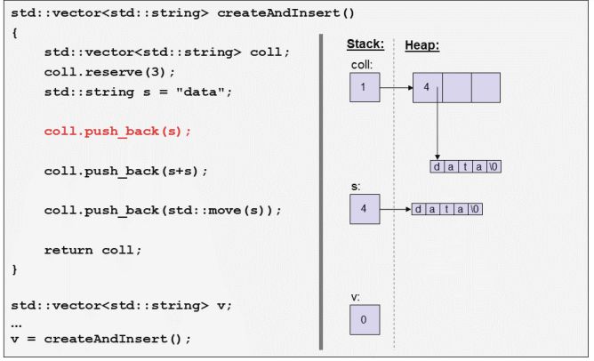

We have two vectors, v and coll, and two strings, s and its copy, which is the first element in coll.
They should all be separate objects with their own memory for the value, because modifying one of them should not impact any ofthe other objects.
• This is where things change. First, let us look at the statement that creates a new temporary string and inserts it into the vector:
```cpp
coll.push_back(s+s);
```

Again, this statement is performed in three steps:

1. We create the temporary string `s+s`:

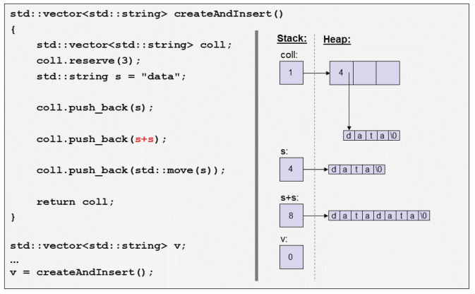

2. We insert this temporary string into the vector coll. However, here something different happens now: we steal the memory for the value from s+s and move it to the new element of coll.

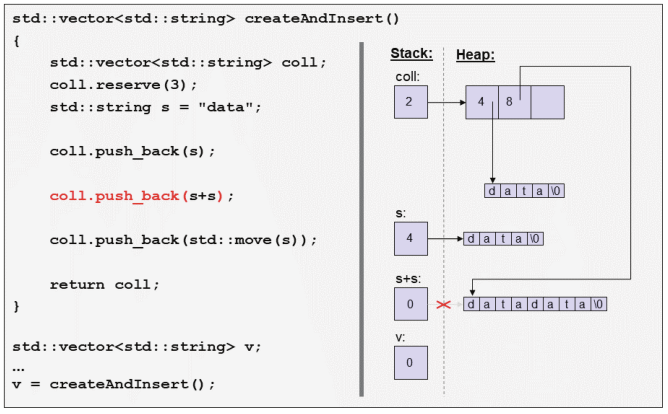

This is possible because since C++11, we can implement special behavior for getting a value that is no longer needed. The compiler can signal this fact because it knows that right after performing the `push_back()` call, the temporary object s+s will be destroyed. So, we call a different implementation of `push_back()` provided for the case when the caller no longer needs that value. As we can see, the effect is an optimized implementation of copying a string where we no longer need the value: instead of creating an individual deep copy, we copy both the size and the pointer to the memory. However, that shallow copy is not enough; we also modify the temporary object `s+s` by setting the size to `0` and assigning the nullptr as new value. Essentially, s+s is modif i ed so that it gets the state of an empty string. The important point is that it no longer owns its memory. And that is important because we still have a third step in this statement.

3. At the end of the statement, the temporary string s+s is destroyed because we no longer need it. However, because the temporary string is no longer the owner of the initial memory, the destructor will not free this memory.

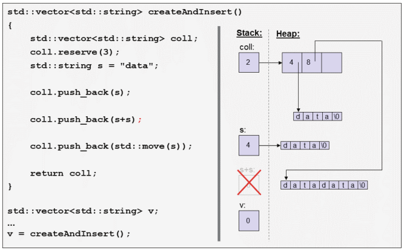

Essentially, we optimize the copying so that we move the ownership of the memory for the value of s+s
to its copy in the vector.
This is all done automatically by using a compiler that can signal that an object is about to die, so that
we can use new implementations to copy a string value that steals the value from the source. It is not a
technical move; it is a semantic move implemented by technically moving the memory for the value from
the source string to its copy.
• The next statement is the statement we modif i ed for the C++11 version. Again, we insert s into coll,
but the statement has changed by calling std: :move() for the string s that we insert:
```cpp
coll.push_back(std:: move(s));
```
Without `std::move()`, the same would happen as with the first call of `push_back()`: the vector would create a *deep copy* of the passed string s. However, in this call, we have marked s with `std::move()`, which semantically means *`“I no longer need this value here.”`* As a consequence, we have another call of the other implementation of `push_back()`, which was used when we passed the temporary object `s+s`. The third element steals the value by moving the ownership of the memory for the value from s to its copy:

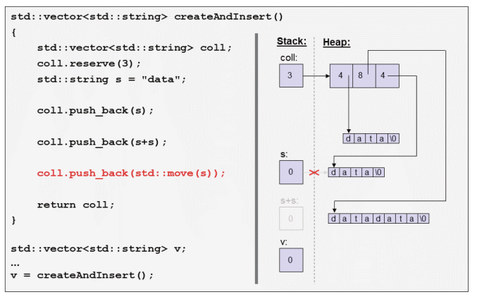

Note the following two very important things to understand about move semantics:
- - `std::move(s)` only marks s to be movable in this context. It *does not move anything*. It only says, *`“I no longer need this value here.”`* It allows the implementation of the call to benef i t from this mark by performing some optimization when copying the value, such as stealing the memory. Whether the value is moved is something the caller *`does not know`*.

- - However, an optimization that steals the value has to ensure that the source objectis still in a valid state. A moved-from object is neither partially nor fully destroyed. The C++ standard library formulates this for its types as follows: after an operation called for an object marked with std:: move(), the object
is in a *`valid but unspecified state`*.

That is, after calling
```cpp
coll.push_back(std:: move(s));
```
it is guaranteed that `s` is still a valid string. You can do whatever you want as long as it is valid for any string where you do not know the value. It is like using a string parameter where you do not know which value was passed.

Note that it is also not guaranteed that the string either has its old value or is empty. The value it has is up to the implementers of the (library) function. In general, implementers can do with objects marked with `std::move()` whatever they like, provided they leave the object in a valid state. There are good reasons for this guarantee, which will be discussed later.
• Again, at the end of `createAndInsert()` we come to the return statement:
```cpp
return coll;
}
```

It is still up to the compiler whether it generates code with the named return value optimization, which would mean that coll just becomes the return value. However, ifthis optimization is not used, the return statement is still cheap, because again we have a situation where we create an object from a source that is about to die. That is, if the named return value optimization is not used, move semantics will be used, which means that the return value steals the value from coll. At worst, we have to copy the members for `size`, `capacity`, and the pointer to the memory (in total, usually 12 or 24 bytes) from the source to the return value and assign new values to these members in the source.

Let us assume that we have the named return value optimization. In that case, at the end of the return statement, coll now becomes the return value and the destructor of s is called, which no longer has to free any memory because it was moved to the third element of coll:

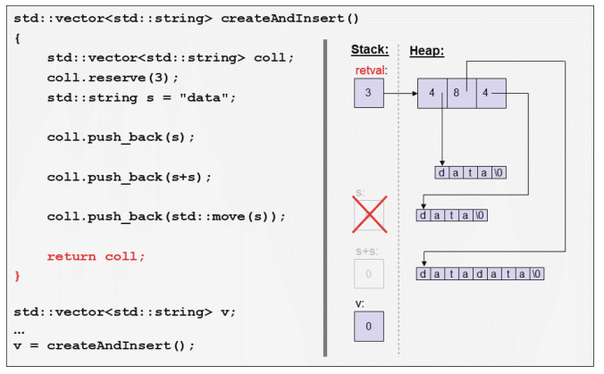

So, f i nally, we come to the assignment of the return value to v:
```cpp
v = createAndInsert();
```
Again, we can benefit from move semantics now because we have a situation we have already seen: we have to copy (here, assign) a value from a temporary return value that is about to die.
Now, move semantics allows us to provide a different implementation of the assignment operator for a vector that just steals the value from the source vector:

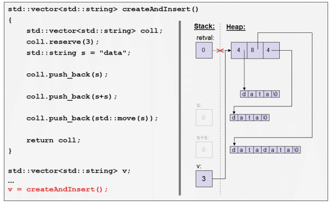

Again, the temporary object is not (partially) destroyed. It enters into a valid state but we do not know its value.
However, right after the assignment, the end ofthe statement destroys the (modified) temporary return value:

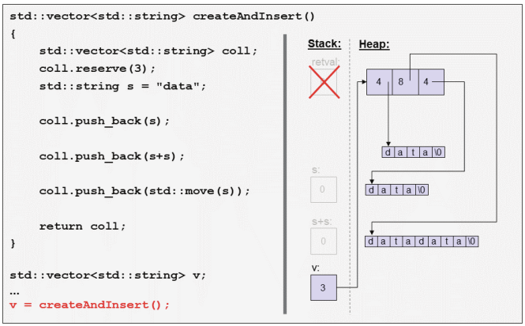

At the end we are in the same state as before using move semantics but something signif i cant has changed:
we saved six allocations and releases ofmemory. All unnecessary memory allocations no longer took place:
• Allocations for inserting a temporary object into the collection
•Allocations for inserting a named object into the collection, when we use `std::move()` to signal that we no longer need the value
•Allocations for assigning a temporary vector with all its elements

In the second case, the optimization was done with our help. By adding std: :move(), we had to say that
we no longer needed the value ofs there. All other optimizations happened because the compiler knows that
an object is about to die, meaning that it can call the optimized implementation, which uses move semantics.
This means that returning a vector of strings and assigning it to an existing vector is no longer a perfor-
mance issue. We can use a vector of strings naively like an integral type and get much better performance.
In practice, recompiling code with move semantics can improve speed by 10% to 40% (depending on how naive the existing code was).

### 1.2 Implementing Move Semantics

Let us use the previous example to see where and how move semantics is implemented.
Before move semantics was implemented, class `std::vector<>` had only one implementation of `push_back()` (the declaration of vector is simplified here):
```cpp
template<typename T>
class vector {
public:
...
// insert a copy of elem:
void push_back (const T& elem);
...
};
```

There was only one way to pass an argumentto push_back() binding itto aconst reference. `push_back()` is implemented in a way that the vector creates an internal copy of the passed argument without modifying it. 

Since C++11, we have a second overload of `push_back()`:
```cpp
template<typename T>
class vector {
public:
    ...
    // insert a copy of elem:
    void push_back (const T& elem);
    // insert elem when the value of elem is no longer needed:
    void push_back (T&& elem);
    ...
};

```

The second `push_back()` uses a new syntax introduced for move semantics. We declare the argument with *two &* and without const. Such an argument is called an `rvalue reference`[3].  “Ordinary references” that
have only one & are now called lvalue references. That is, in both calls we pass the value to be inserted by
reference. However, the difference is as follows:
• With push_back(const T&), we promise not to modify the passed value.
This function is called when the caller still needs the passed value.

•With push_back(T&&), the implementation can modify the passed argument (therefore it is not const) to “steal” the value. The semantic meaning is still that the new element receives the value of the passed argument but we can use an optimized implementation that moves the value into the vector.

This function is called when the caller no longer needs the passed value. The implementation has to ensure that the passed argument is *still in a valid state*. However, the value may be changed. Therefore, after calling this, the caller can still use the passed argument as long as the caller does not make any
assumption about its value.
However, a vector *`does not know how to copy or move an element`*. After making sure that the vector has enough memory for the new element, the vector delegates the work to the type of the elements.
In this case, the elements are strings. So, let us see what happens if we copy or move the passed string.

##### 1.2.1 Using the Copy Constructor

`push_back(const T&)` for the traditional copy semantics calls the **copy constructor** of the string class,
which initializes the new element in the vector. Let us look at how this is implemented. The copy constructor of a very naive implementation ofa string class would look like this: [4]
```cpp
class string {
private:
    int len; //current number ofcharacters
    char* data; //dynamic array ofcharacters
public:
    // copy constructor: create a full copy of s:
    string (const string& s) : len{s. len} { //copy number ofcharacters
        if (len > 0) { //ifnot empty
            data = new char[len+1] ; //- allocate new memory
            memcpy(data, s. data, len+1); //- and copy the characters
        }
    }
...
};
```
Given that we call this copy constructor for a string that has the value "data":

```cpp
std::string a = "data";
std::string b = a; //create b as a copy of a
```

after initializing the string a as follows:

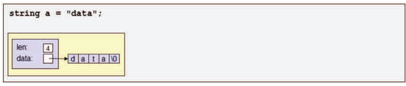

the copy constructorabove would copy the member len for the number of characters but assign new memory for the value to the data pointer and copy all characters from the source a (passed as s) to the new string:

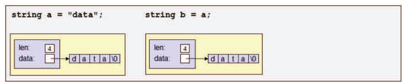

> [3] The reason this is called an `rvalue reference` is discussed later in the chapter about value categories.

> [4] The implementation ofclass std::string is more complicated because for its internal memory management it uses optimizations and allocators (helper objects that def i ne the way to allocate memory).

##### 1.2.2 Using the Move Constructor

`push_back(T&&)` for the new move semantics calls a corresponding new constructor, the move constructor.
This is the constructor that creates a new string from an existing string, where the value is no longer needed.
As usual with move semantics, the constructor is declared with a `non-const rvalue reference (&&)` as its parameter:
```cpp
class string {
private:
    int len; //current number ofcharacters
    char* data;//dynamic array ofcharacters
public:
    ...
    // move constructor: initialize the new string from s (stealing the value):
    string (string&& s) : len{s.len}, data{s.data} { //copy number ofcharacters and pointer to memory
        s. data = nullptr; //release the memory for the source value
        s. len = 0; //and adjust number ofcharacters accordingly
    }
    ...
};
```

Given the situation from the copy constructor above:

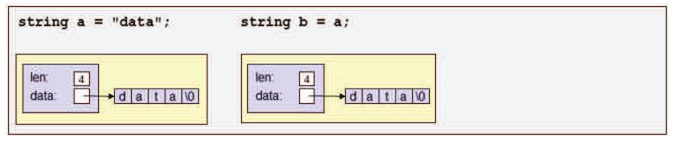

we can call this constructor for a string as follows:
```cpp
std::string c = std::move(b); //init c with the value of b (no longer needing its value here)
```

The move constructor first copies both the members len and data, meaning that the new string gets ownership of the value of b (passed as s).

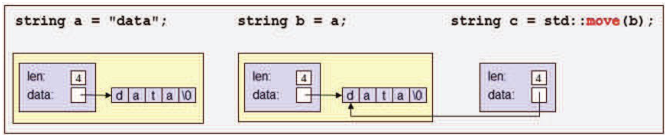

However, this is not enough, because the destructor of b would free the memory. Therefore, we also modify
the source string to lose its ownership of the memory and bring it into a consistent state representing the
empty string:

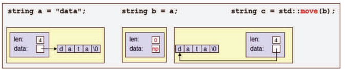

The effect is that c now has the former value of b and that b is the empty string. Again, note that the only guarantee is that b is subsequently in a valid but unspecified state. Depending on the way the move constructor is implemented in a C++ library, it might not be empty (but it usually is because this is the easiest and best way to improve performance here).


### 1.3 Copying as a Fallback

We saw that by using temporary objects or marking objects with `std::move()` we can enable move semantics. Functions providing special implementations (by taking non-const rvalue references) can optimize the copying of a value by “stealing” the value from the source. However, if there is no optimized version of a function for move semantics, then the usual copying is used as a fallback.

For example, assume a container class like vector lacks the second overload of `push_back():`

```cpp
template<typename T>
class MyVector {
public:
    ...
    void push_back (const T& elem); //insert a copy of elem
    ... //no other push_back() declared
};

```

We can still pass a temporary object or an object marked with `std::move()`:

```cpp
MyVector<std::string> coll;
std::string s{"data"};
...
coll.push_back(std::move(s)); //OK, uses copy semantics
```

The rule is that for a temporary object or an object marked with `std::move()`, if available, a function declaring the parameter as an `rvalue reference` is preferred. However, if no such function exists, the usual copy semantics is used. That way, we ensure that the caller does not have to know whether an optimization exists. The optimization might not exist because:

• The function/class was implemented before move semantics was supported or without having move semantics support in mind

• There is nothing to optimize (a class with only numeric members would be an example ofthat)

For generic code, it is important that we can always mark an object with `std::move()` if we no longer need its value. The corresponding code compiles even if there is no move semantics support.

For the same reason, you can even mark objects of a fundamental data type such as int (or a pointer) with `std::move()`. The usual value semantics copying the value (the address) will still be used:

```cpp
std::vector<int> coll;
int x{42};
...
coll.push_back(std::move(x)); //OK, but copies x (std::move() has no effect)
```

> 上面的程序之所以使用的是复制，而不是`move`,这是因为我们要insert到`vector`当中是一个`int`,`c++`当中对`int`是直接采用`值语义` --> 或者从另一个角度来理解，我们把`int`看成一个类型，这个类型没有定义`move constructor`,因此`std::move()`对他无效


### 1.4 Move Semantics for const Objects

Finally, note that objects declared with const cannot be moved because any optimizing implementation
requires that the passed argument can be modif i ed. We cannot steal a value if we are not allowed to modify
it.
With the usual overloads of `push_back():`

```cpp
template<typename T>
class vector {
public:
    ...
    // insert a copy of elem:
    void push_back (const T& elem);
    // insert elem when the value of elem is no longer needed:
    void push_back (T&& elem);
    ...
};
```

the only valid function to call for const objects is the f i rst overload of push_back() with the `const&` parameter:
```cpp
std: :vector<std: :string> coll;
const std: :string s{"data"};
...
coll.push_back(std:: move(s));//OK, calls push_back(const std: :string&)
```

That means that a `std::move()` for const objects essentially has no effect.
In principle, we could provide a special overload for this case by declaring a function taking a const
rvalue reference. However, this makes no semantic sense. Again, the const lvalue reference overload
serves as a fallback to handle this case.

#### 1.4.1 const Return Values

The fact that const disables move semantics also has consequences for declaring return types. A const
return value cannot be moved.
Therefore, since C++11, it is no longer good style to return by value with const (as some style guides
have recommended in the past). For example:
```cpp
const std: :string getValue();
std: :vector<std: :string> coll;
...
coll.push_back(getValue()); //copies (because the return value is const)
```

When returning by value, do not declare the return value as a whole to be const. Use const only to declare parts ofyour return type (such as the object a returned reference or pointer refers to):

```cpp
const std: :string getValue(); //BAD: disables move semantics for return values
const std: :string& getRef(); //OK
const std: :string* getPtr(); //OK
```

### 1.5 Summary

• Move semantics allows us to optimize the copying ofobjects, where we no longerneed the value. Itcan be
used implicitly (for unnamed temporary objects or local return values) or explicitly (with std: :move()).
• std: :move() means Ino longer need this value here. It marks the object as movable. An object marked
with std: :move() is not (partially) destroyed (the destructor still will be called).
•By declaring a function with a non-const rvalue reference (such as std: :string&&), you def i ne an
interface where the caller semantically claims that it no longer needs the passed value. The implementer
of the function can use this information to optimize its task by “stealing” the value or do any other
modif i cation with the passed argument. Usually, the implementer also has to ensure that the passed
argument is in a valid state after the call.

- Moved-from objects of the C++ standard library are still valid objects, but you no longer know their
value.
- Copy semantics is used as a fallback for move semantics (if copy semantics is supported). If there is no
implementation taking an rvalue reference, any implementation taking an ordinary const lvalue reference
(such as const std: :string&) is used. This fallback is then used even ifthe object is explicitly marked
with std: :move().
- Calling std: :move() for a const object usually has no effect.
- If you return by value (not by reference), do not declare the return value as a whole to be const.


----------------------------------------------------------------------------------

## Chapter 2 Core Features of Move Semantics

After the first motivating example, this chapter discusses the basic features ofmove semantics. 

### 2.1 Rvalue References

To support move semantics we introduce a new type of reference: `rvalue references`. Let us discuss what they are and how to use them.

#### 2.1.1 Rvalue References in Detail

Rvalue references are declared with two ampersands. Just as ordinary references, which are declared with one ampersand and are now called lvalue references, rvalue references refer to an existing object that has to be passed as an `initial value`. However, according to their semantic meaning, rvalue references can refer only to a `temporary object` that does not have a name or to an object marked with `std::move()`:

```cpp
std::string returnStringByValue(); //forward declaration
...
std::string s{"hello"};
...
std::string&& r1{s}; //ERROR
std::string&& r2{std::move(s)}; //OK
std::string&& r3{returnStringByValue()}; //OK, extends lifetime of return value
```

The name rvalue reference comes from the fact that these objects can usually refer only to rvalues, a value category for temporary objects that do not have a name and objects marked with `std::move()`.

As usual for successful initializations of references from return values, references extend the lifetime of the return value until the end of the lifetime of the reference (ordinary const lvalue references already had this behavior).

The syntax used to initialize the reference is irrelevant. You can use the equal sign, braces, or parentheses:

```cpp
std::string s{"hello"};
...
std::string&& r1 = std::move(s); //OK, rvalue reference to s

std::string&& r2{std::move(s)}; //OK, rvalue reference to s

std::string&& r3(std::move(s)); //OK, rvalue reference to s
```

All these references have the semantics of “we can steal/modify the object we refer to, provided the state of the object remains a valid state.” Technically, these semantics are not checked by compilers, so we can modify an rvalue reference as we can do with any non-const object of the type. We might also decide not to modify the value. That is, if you have an rvalue reference to an object, the object might receive a different value (which might or might not be the value ofa default-constructed object) or it might keep its value.
As we have seen, move semantics allows us to optimize using a value of a source that no longer needs the value. If compilers automatically detect that a value is used from an object that is at the end of its lifetime, they will automatically switch to move semantics. This is the case when:

- We pass the value of a temporary object that will automatically be destroyed after the statement.
- We pass a non-const object marked with `std::move()`.

#### 2.1.2 Rvalue References as Parameters

When we declare a parameter to be an rvalue reference, it has exactly the behavior and semantics as introduced above:

- The parameter can bind only to a temporary object that does not have a name or to an object marked with `std::move()`.

- According to the semantics of rvalue references:

- 1. The caller claims that it is no longer interested in the value. Therefore, you can modify the object the parameter refers to.
- 2. However, the caller might still be interested in using the object. Therefore, any modif i cation should keep the referenced object in a valid state.

    For example:

    ```cpp
    void foo(std::string&& rv); //takes only objects where we no longer need the value
    ...
    std::string s{"hello"};
    ...
    foo(s); //ERROR
    foo(std::move(s)); //OK, value of s might change
    foo(returnStringByValue()); //OK
    ```

You can use a named object after passing it with `std::move()` but *`usually you should not`*. The recommended programming style is to no longer use an object after a `std::move()`:
```cpp
void foo(std::string&& rv); //takes only objects where we no longer need the value
...
std::string s{"hello"};
...
foo(std::move(s)); //OK, value of s might change

std::cout << s << \n ; //OOPS, you don’t know which value is printed

foo(std::move(s)); //OOPS, you don’t know which value is passed
s = "hello again"; //OK, but rarely done
foo(std::move(s)); //OK, value of s might change

```

For both lines marked with “OOPS,” the call is technically OK as long as you make no assumption about the current value of s. Printing out the value is therefore fine, although usually not very useful.

### 2.2 std:: move()

If you have an object for which the lifetime does not end when you use it, you can markitwith `std::move()` to express “I no longer need this value here.” `std::move()` does not move; it only sets a temporary marker in the context where the expression is used:

```cpp
void foo1(const std::string& lr); //binds to the passed object without modifying it
void foo1(std::string&& rv); //binds to the passedobjectandmightsteal/modify the value
...
std::string s{"hello"};
...
foo1(s); //calls the first foo1(), s keeps its value
foo1(std::move(s));//calls the second foo1(), s might lose its value
```

Objects marked with `std::move()` can still be passed to a function that takes an ordinary *const lvalue reference*:

```cpp
void foo2(const std::string& lr); //binds to the passed object without modifying it
... //no other overload of foo2()
std::string s{"hello"};
...
foo2(s); //calls foo2(), s keeps its value
foo2(std::move(s));//also calls foo2(), s keeps its value
```

Note that an object marked with `std::move()` **cannot** be passed to a *non-const lvalue reference*:
```cpp
void foo3(std::string&);//modifies the passed argument
...
std::string s{"hello"};
...
foo3(s); //OK, calls foo3()
foo3(std::move(s)); //ERROR: no matching foo3() declared
```

Note that it does not make sense to mark a dying object with `std::move()`. In fact, this can even be counterproductive for optimizations.

#### 2.2.1 Header File for std::move()

`std::move()` is defined as a function in the C++ standard library. Therefore, to use it, you have to include the header file `<utility>` where it is defined:
```cpp
#include <utility> //for std::move()
```

Programs using `std::move()` usually compile without including this header file, because in practice almost all header files include `<utility>`. However, no standard header file is required to include utility.
Therefore, when using `std::move()`, you should explicitly include <utility> to make your program
portable.

#### 2.2.2 Implementation of std::move()

`std::move()` is nothing but a `static_cast` to an *rvalue reference*. You can achieve the same effect by
calling `static_cast` manually as follows:

```cpp
foo(static_cast<decltype(obj)&&>(obj)); //same effect as foo(std::move(obj))
```

Therefore, we could also write:
```cpp
std::string s;
...
foo(static_cast<std::string&&>(s)); //same effect as foo(std: :move(s))
```

Note that the `static_cast` does a bit more than only changing the type of the object here. It also enables the object to be passed to an rvalue reference (remember that passing objects with names to rvalue references is usually not allowed). We will discuss this in detail in the chapter about value categories.

### 2.3 Moved-From Objects

After a `std::move()`, moved-from objects are not (partially) destroyed. They are still valid objects for which at least the destructor will be called. However, they should also be valid in the sense that they have a consistent state and all operations work as expected. The only thing you do not know is their value. It is like using a parameter of the type where you have no clue which value was passed.

#### 2.3.1 Valid but Unspecified State

The C++ standard library guarantees that moved-from objects are in a valid but unspecified state.
Consider the following code:

```cpp
std::string s;
...
coll.push_back(std::move(s));
```

After passing s with `std::move()` you can ask for the number of characters, print out the value, or even assign a new value. However, you cannot print the first character or any other character without checking the number ofcharacters first:
```cpp
foo(std::move(s)); //keeps s in a valid but unclear state
std::cout << s << \n ; //OK (don’t know which value is written)
std::cout << s.size() <<\n ; //OK (writes current number ofcharacters)
std::cout << s[0] << \n ; //ERROR (potentially undefined behavior)
std::cout << s.front() << \n ; //ERROR (potentially undefined behavior)
s = "new value";//OK
```

Although you do not know the value, the string is in a *consistent state*. For example, `s.size()` will return the number of characters so that you can iterate over all valid indexes:
```cpp
foo(std::move(s)); //keeps s in a valid but unclear state
for (int i = 0; i < s.size(); ++i) {
    std::cout << s[i] ; //OK
}
```

For user-defined types you should also ensure that moved-from objects are in a valid state, which sometimes requires the declaration or implementation of move operations. The chapter Moved-From States will discuss this in detail.

#### 2.3.2 Reusing Moved-From Objects

You might wonder why moved-from objects are still valid objects and are not (partially) destroyed. The reason is that there are useful applications of move semantics where it makes sense to use moved-from objects again.
For example, consider code where we read line-by-line strings from a stream and move them into a vector:

```cpp
std::vector<std::string> allRows;
std::string row;
while (std::getline(myStream, row)) { //read next line into row
    allRows.push_back(std::move(row)); //and move it to somewhere
}
```

Each time after we read a line into row, we use `std::move()` to move the value of row into the vector of all rows. Then, `std::getline()` uses the moved-from object row again to read the next line into it.
As a second example, consider a generic function that swaps two values:
```cpp
template<typename T>
void swap(T& a, T& b)
{
    T tmp{std::move(a)};
    a = std::move(b); //assign new value to moved-from a
    b = std::move(tmp); //assign new value to moved-from b
}
```

Here, we move the value of a into a temporary object to be able to move-assign the value of b afterwards.
The moved-from object *b* then receives the value of *tmp*, which is the former value of *a*.  
Code like this is used in sorting algorithms for example, where we move the values of the different elements around to bring them into a sorted order. Assigning new values to moved-from objects happens there all the time. The algorithm might even use the sorting criterion for such a moved-from object.
In general, moved-from objects should be valid objects that *can be destroyed* (the *`destructor should not fail`*), reused to get other values, and support all other operations objects their type supports without knowing the value. The chapter `Moved-From States` will discuss this in detail.

#### 2.3.3 Move Assignments of Objects to Themselves

The rule that moved-from objects are in a valid but unspecified state usually also applies to objects after a direct or indirect *self-move*.
For example, after the following statement, object x is usually valid without its value being known:
```cpp
x = std::move(x); //afterwards x is valid but has an unclear value
```

Again, the C++ standard library guarantees that for its objects[1]. User-defined types should usually also provide this guarantee, but sometimes you have to implement something to fix the default-generated moved-from states.

### 2.4 Overloading by Different References

After introducing rvalue references, we now have three major ways of call-by-reference:

- `void foo(const std::string& arg)`

takes the argument as const lvalue reference.     

This means that you have only read access to the passed argument. Note that you can pass everything to a function declared that way if the type fits:
- 1. A modifiable named object
- 2. A const named object
- 3. A temporary object that does not have a name
- 4. An object marked with `std::move()`

The semantic meaning is that we give `foo()` read access to the passed argument. The parameter is what we call an in parameter.

- `void foo(std::string& arg)`

takes the argument as non-const lvalue reference.

This means that you have write access to the passed argument. Note that you can no longer pass everything to a function declared that way even if the type fits. You can only pass:
- 1. A modifiable named object

For all other arguments, the call does not compile. The semantic meaning is that we give foo() read/write access to the passed argument. The parameter is what we call an out or in/out parameter.

- `void foo(std:: string&& arg)`

takes the argument as non-const rvalue reference.

This also means that you have write access to the passed argument. However, again you have restrictions on what you can pass. You can only pass:
- 1. A temporary object that does not have a name
- 2. An non-const object marked with `std::move()`

> [1]:The guarantees for moved-from library objects were clarified with the library working group issue 2839 (see `http://wg21.link/lwg2839`).

The semantic meaning is that we give foo() write access to the passed argument to steal the value. It is an in parameter with the additional constraint that the caller no longer needs the value.        
Note that rvalue references bind to other arguments than non-const lvalue references. Therefore, we had to introduce a new syntax and could not just implement move semantics as a different way of functions that modify passed arguments.  

#### 2.4.1 const Rvalue References

Technically, there is a fourth way of call-by-reference:
- `void foo(const std::string&& arg)`

takes the argument as const rvalue reference.
This also means that you have read access to the passed argument. Here, the restrictions would be that you can only pass:
- 1. A temporary object that does not have a name
- 2. A const or non-const object marked with `std::move()`

However, there is no useful semantic meaning of this case. As an rvalue reference, stealing the value is allowed, but being const, we disable any modification of the passed argument. This is a contradiction in itself.   
Nevertheless, creating objects with this behavior is quite easy: Simply mark a const object with `std::move()`:

```cpp
const std::string s{"data"};
...
foo(std::move(s)); //would call a function declared as const rvalue reference
```

This might happen indirectly when declaring a function to return a value with const:
```cpp
const std::string getValue();
...
foo(getValue()); //would call a function declared as const rvalue reference
```

Semantically, this case is usually covered by the const lvalue reference overload of a function for read access. A specific implementation of this case is possible but usually makes no sense (the C++ standard library class `std::optional<>` uses **const rvalue references**).

### 2.5 Passing by Value

If you declare a function to take an argument by value, move semantics might also (automatically) be used.

For example:
```cpp
void foo(std::string str);//takes the object by value
...
std::string s{"hello"};
...
foo(s); //calls foo(), str becomes a copy of s
foo(std::move(s)); //calls foo(), s is moved to str
```


